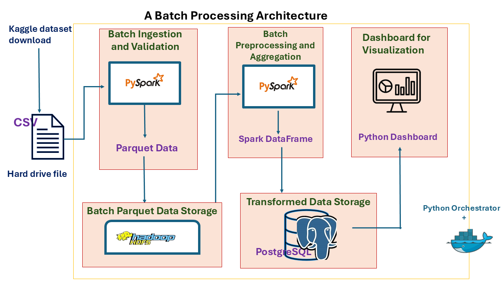


# Batch Processing Architecture

## Table of Contents
- [Overview](#overview)
- [Project Structure](#project-structure)
- [Features](#features)
- [Dataset](#dataset)
- [Getting Started](#getting-started)
- [Project Architecture](#project-architecture)
- [Data Flow Overview](#data-flow-overview)
- [Testing](#testing)
- [Future Improvements](#future-improvements)


## Overview
This repository contains a scalable batch processing pipeline built using Apache Spark, HDFS, PostgreSQL, and Docker. The pipeline orchestrates data ingestion, transformation, and visualization in a distributed environment.


## Project Structure

<pre>
 batch_processing/ 
  |
  | ├── Data/                 data downloaded from Kaggle
  |     ├── raw_fraud.csv
  |
  ├── data_visualization/     Visualization tool (Dash, Plotly)
  | ├── assets/
  |     ├── dash_styles.css
  | ├── __init__.py
  | ├── .env
  | ├── dash_app.py
  | ├── Dockerfile
  | ├── logger_config.py
  | ├── requirements.txt
  | ├── visualization.log
  |
  ├── hdfs_docker/             HDFS setup with Docker 
  | ├── datanode/
  |     ├── core-site.xml
  |     ├── hdfs-site.xml
  | ├── namenode/
  |     ├── core-site.xml
  |     ├── hdfs-site.xml
  |
  ├── postgres_db/             PostgreSQL database setup
  | ├── conf/
  |     ├── pg.hba.conf
  |     ├── postgresql.conf
  | ├── logs/
  |     ├── postgres.log
  | ├── ssl/
  |     ├── server.crt
  |     ├── server.key
  | ├── db_var.env
  | ├── Dockerfile
  | ├── init-db.sql
  | ├── ingestion.py
  |
  ├── spark_ingestion/        Data ingestion scripts
  | ├── data/
  | ├── logs/
  |     ├── spark-ingestion.log
  | ├── __init__.py
  | ├── .env
  | ├── Dockerfile
  | ├── ingestion.py
  | ├── log4j.properties
  |
  ├── spark_transformation/    Spark transformations & processing
  | ├── logs/
  |     ├── spark_transform.log
  | ├── test_scripts/
  |     ├── test_postgres.py
  | ├── __init__.py
  | ├── .env
  | ├── Dockerfile
  | ├── log4j.properties
  | ├── transformation.py
  | ├── write_to_db.py
  |
  ├── dockerignore
  |
  ├── gitignore
  |
  ├── docker-compose.yml       Defines the containerized services
  |
  ├── flowChart.png            Project Architecture
  |
  ├── orchestrator.py          Controls pipeline execution
  |
  ├── orchestrator.log         Logs pipeline execution
  |
  ├── README.md                Project documentation
</pre>

## Features
- **Automated Orchestration** – The orchestrator.py script starts, schedules and manages the pipeline.
- **Containerized Services** – All components run in Docker for easy deployment.
- **Distributed Processing** – Uses Apache Spark for efficient batch data processing.
- **PostgreSQL Integration** – Stores processed data for analytics.
- **HDFS Storage** – Manages large-scale data ingestion.
- **Data Visualization** – Provides insights using interactive dashboards.


## Dataset
**Downloaded from:**
https://www.kaggle.com/datasets/devanisdwisutrisno/fraud-transactions-with-timestamp


## Project Architecture



## Data Flow Overview:
- Raw fraud data → Spark_ingestion → Parquet file → HDFS → Spark_transformation → PostgreSQL → Python Dashboard .


## Getting Started

### Prerequisites
Ensure you have the following installed:

Docker & Docker Compose

Python 3.x

VS code (or any IDE of choice)


### Setup

1. **Clone the Repository**:
Clone the GitHub repository to get started or you can create your own project folder.
    ``` bash
    git clone https://github.com/OnyiChuks/batch_processing_architecture.git
    cd batch_processing_architecture
    ```


2. **Set Up Environment Variables:**
Create a .env file for PostgreSQL, Spark_Ingestion, Spark_Transformation and Data_visualization. Define necessary configurations like database user and password, Spark Encryption and Decryption Key.

 

3. **Automatically build and start the Pipeline by running the Orchestrator script:**
 ```bash
    python orchestrator.py
 ```
 Using the orchestrator script removes the process of individually building the images before running the pipeline


4. **Monitoring Output and Results**

   - View ingested Parquet data in hdfs after spark_ingestion runs(in the browser).
     `http://localhost:9870/explorer.html#/processed_fraud_data`

   - Query PostgreSQL for data after spark_transformation runs using user roles and previleges defined in Postgres init-db.sql.
        ```bash
        docker exec -it postgres-db psql -U username -d my_database -W
        ```

        - Enter password when prompted;

        - Inside postgreSQL bash:
        
        ```bash
        Select * from transformed_data;
        ```

   - Examine logs and output for any issues.
     - Logs are persisted in a file in each service folder
     - The orchestrator.log stores general orchestration logs


   - View dashboard for data visualization
       `
       http://0.0.0.0/8580 
       http://localhost/8580
       http://127.0.0.1:8050 

      `


5. **Stop the Pipeline:**
    - Stop without removing Containers
    ``` bash
    docker-compose -p fraud_transaction_pipeline down
    ``` 

    - To remove everything, including volumes (which persists data):
    ``` bash
    docker-compose -p fraud_transaction_pipeline down -v 
    ``` 

   Where "fraud_transaction_pipeline" is the project name used in the orchestrator.py to enable proper shut down of the pipeline.

   - To remove all unused images, containers, volumes, and networks (total clean-up of Docker resources):
     ``` bash
     docker system prune -a
     ``` 


## Testing

**To run the tests for HDFS, and PostgreSQL connection:**
- Access the container that holds the test scripts. Example , is the container is spark-transformation, use:
``` bash
 docker exec -it spark-transformation bash
``` 

- Run the desired test using pytest. For example:
``` bash
 python3 -m pytest test_scripts/[script_name]
``` 
Where [script_name] is the test file name. 

- Note: Running pytest from your local terminal will not work unless the script and testing environment are inside the running container.


## Future Improvements
- Implement real-time streaming with Apache Kafka and Spark Streaming

- Optimize Spark job performance

- Use Airflow for orchestration

- Use advanced visualization tools like Power BI and Tableau


